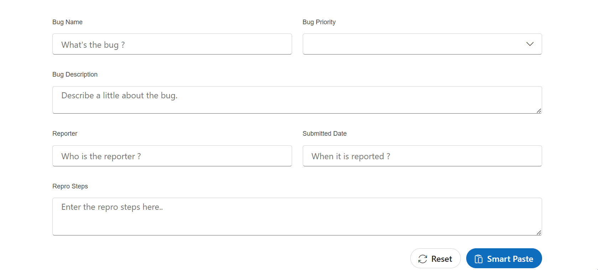

# Syncfusion React SmartPasteButton component

The `SmartPasteButton` is an advanced AI component built on top of Syncfusion's Button component. It inherits all the robust features and functionalities of the standard Syncfusion Button component while introducing an innovative intelligent pasting capability. This component leverages AI to intelligently paste clipboard data, ensuring that the pasted content is contextually relevant and formatted correctly.

By integrating the capabilities of AI, the `SmartPasteButton` goes beyond simple data insertion. It ensures that pasted content is contextually relevant and is ideal for applications where users frequently copy and paste data.



### Example Use Cases

* **Online Job Application**

   A job applicant could copy their resume or LinkedIn profile summary and click "Smart Paste" in the job application form. This would automatically populate fields such as "Work Experience", "Skills", "Education" and "Personal Statement", streamlining the application process and ensuring that all relevant information is included.

* **Bug Tracking Form**

   A user could copy a brief description of a bug from an IM or chat message and then click "Smart Paste" on the "Create New Issue" page. The system would automatically populate fields like "Title", "Priority", "Description" and "Repro Steps" based on the clipboard content. The language model would also rephrase and structure the input as needed, converting phrases like "I clicked X on Y screen" into steps like "1. Navigate to screen Y, 2. Click X."

## Adding Syncfusion SmartPasteButton in React

### Prerequisites

**Install the Syncfusion SmartPasteButton Package**

To start working with the `SmartPasteButton` component, ensure that the **@syncfusion/ej2-react-buttons packages** are installed. You can verify this in the **~/package.json** file.

### Adding the SmartPasteButton component

Add the HTML button tag with the `id` attribute as `smart-paste-button` to your `index.html` file.

```html

   <!--Element to render the Smart Paste Button component-->
   <button id="smart-paste-button"></button>

```

Then, import the SmartPasteButton component in your `app.ts` file and initialize it with the `#smart-paste-button`.

```ts

import { SmartPasteButton } from '@syncfusion/ej2-buttons';

// Initialize SmartPasteButton control.
let button: SmartPasteButton = new SmartPasteButton({
  content: 'Smart Paste',
  iconCss: "e-icons e-paste",
  aiAssistHandler: serverAIRequest
});
// Render initialized SmartPasteButton.
button.appendTo('#smart-paste');

const serverAIRequest = async (options: ChatOptions) => {
  let output: string | null = '';
  try {
    output = await (window as any).AzureAIRequest(options) as string;
    output = output.replace('END_RESPONSE', '')
  } catch (error) {
    console.error("Error:", error);
  }
  return output;
};

```

## Customizing the Syncfusion SmartPasteButton

`SmartPasteButton` inherits all functionalities and properties from the `Syncfusion Button control`. This means you can use all the properties and customization options available for the Button in the SmartPasteButton as well.

For more information and a detailed guide on using these properties, refer to the official [Button Documentation](https://ej2.syncfusion.com/react/documentation/button/getting-started).

## Annotating Your Form Fields

`SmartPasteButton` automatically identifies form fields in your `<form>` elements (i.e., `<input>`, `<select>`, and `<textarea>` elements) and generates descriptions based on their associated `<label>`, `name` attributes, or nearby text content. This description is then used to build a prompt for the language model.

You can override these default descriptions for specific form fields by adding a `data-smartpaste-description` attribute. Here are some examples:

```html
<input data-smartpaste-description="The user's vehicle registration number, formatted as XYZ-123" />

<textarea data-smartpaste-description="The job description should start with JOB TITLE in all caps, followed by a paragraph of text"></textarea>

<input type="checkbox" data-smartpaste-description="Check if the product description indicates suitability for children; otherwise, uncheck" />
```

Customizing these descriptions allows you to provide more specific instructions to the language model, which can improve the accuracy and relevance of the generated field values. Keep in mind that language models can produce varied outputs, and effective prompt engineering may require some experimentation to achieve the best results for your specific use case.
