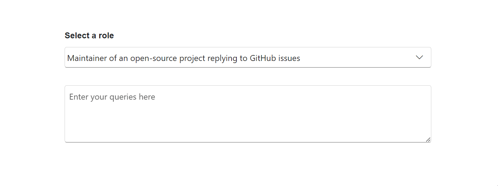

# Syncfusion SmartTextArea control

The `SmartTextArea` is an AI-powered enhancement to the traditional textarea, offering sentence-level autocompletion based on its configuration and user input, improving typing speed and efficiency.



## Example Use Cases

1. **GitHub Issue Responses**

   In an open-source project, maintainers often respond to a variety of issues raised by users. Using `SmartTextArea`, maintainers can quickly draft responses with predefined phrases. For instance, when a maintainer types "To investigate, ", the system might suggest completions like "we'll need a repro as a public Git repo." This reduces response time and ensures consistent, professional communication across issues.

2. **Employee Communicating with Internal Team**

   In internal team communication, `SmartTextArea` can assist employees by providing predefined phrases for common tasks. For instance, when an employee types "Let's collaborate ", the system might suggest completions like "on this project to ensure timely delivery." This ensures that team communication remains clear and efficient, reducing the effort required for repetitive messages.

## Adding Syncfusion SmartTextArea in TypeScript

### Prerequisites

**Install the Syncfusion SmartTextArea Package**

To start working with the `SmartTextArea` control, ensure that the **@syncfusion/ej2 packages** are installed. You can verify this in the **~/package.json** file.

### Adding the SmartTextArea control

Add the HTML textarea tag with the `id` attribute as `default` to your `index.html` file.

```html

    <!--Element to render the Smart TextArea control-->
    <textarea id="default"></textarea>

```

Then, import the Smart TextArea Control in your `app.ts` file and initialize it with the `#default`.

```ts

let textareaObj: SmartTextArea = new SmartTextArea({
    placeholder: 'Enter your queries here',
    floatLabelType: 'Auto',
    resizeMode: 'Both',
    rows: 3,
    cols: 35,
    userRole: 'Employee communicating with internal team',
    UserPhrases: [
        "Please find the attached report.",
        "Let's schedule a meeting to discuss this further.",
        "Can you provide an update on this task?",
        "I appreciate your prompt response.",
        "Let's collaborate on this project to ensure timely delivery."
    ],
    aiSuggestionHandler: serverAIRequest
});
textareaObj.appendTo('#default');

const serverAIRequest = async (settings: any) => {
    let output = '';
    try {
        const response = await (window as any).AzureAIRequest(settings) as string;
        output = response;
    } catch (error) {
        console.error("Error:", error);
    }
    return output;
};

```

The `userRole` attribute is mandatory which defines the context for autocompletion suggestions. Using this, you can further customize the suggestions based on your application's needs.

## Customizing the Syncfusion SmartTextArea

The `SmartTextArea` inherits all functionalities and properties from the `Syncfusion TextArea` control. This means you can use all the properties and customization options available for the TextArea in the `SmartTextArea` as well.

For more information and a detailed guide on using these properties, refer to the official [TextArea Documentation](https://ej2.syncfusion.com/documentation/textarea/getting-started/quick-start).

## Customizing the Suggestions

By default, the `SmartTextArea` provides autocompletion suggestions based on:

- The text around the cursor
- The value of the `userRole` property
- The value of the `userPhrases` property

## User role

The `userRole` property in the **SmartTextArea** control defines the context for AI-driven text suggestions and completions by specifying the role or description of the user interacting with the text area. By setting this property, developers can ensure that the AI-generated content aligns with the specific needs and responsibilities associated with the user's role.

The `userRole` should be a `string` that describes the role of the person typing and the context of their message.

- `"Customer service agent responding to client inquiries"`
- `"Project manager drafting a status update for the team"`
- `"Sales representative replying to a potential client's product query"`

## User phrase

The `userPhrases` property in the **SmartTextArea** enables developers to define and manage custom phrases specific to different users. This feature enhances the AI model’s ability to provide relevant suggestions by incorporating predefined phrases, tone, and context, thus aligning the output with the user's preferred style and organizational policies.

The `userPhrases` should be a `string[]` (array) containing predefined phrases or expressions that align with your desired tone, style, or common responses. This can include frequently used phrases, important URLs, or relevant policies. For example:

- `"Thank you for your interest."`
- `"Please let me know if you have any further questions."`
- `"You can find more details in our user guide at [URL]."`

## Controlling the Suggestion UX

Suggestions in the `SmartTextArea` are shown differently based on the type of device:

- **On non-touch devices (desktop)**: Suggestion appears inline within the textarea, displayed in grey text ahead of the cursor. Users can accept suggestions by pressing the "Tab" key.
- **On touch devices (mobile)**: Suggestion appears in a floating overlay below the cursor. Users can tap on the suggestion in the overlay to accept it. On mobile devices with keyboards, the "Tab" key can also be used, but most mobile devices lack this key.

To customize the default suggestion display behavior based on user preference, use the showSuggestionOnPopup property.

```ts
let textareaObj: SmartTextArea = new SmartTextArea({
    placeholder: 'Enter your queries here',
    floatLabelType: 'Auto',
    resizeMode: 'Both',
    rows: 3,
    cols: 35,
    userRole: 'Employee communicating with internal team',
    UserPhrases: [
        "Please find the attached report.",
        "Let's schedule a meeting to discuss this further.",
        "Can you provide an update on this task?",
        "I appreciate your prompt response.",
        "Let's collaborate on this project to ensure timely delivery."
    ],
    aiSuggestionHandler: serverAIRequest,
    showSuggestionOnPopup: 'Enable'
});
```

### Property Values

<table>
  <thead>
    <tr>
      <th>Property Value</th>
      <th>Behavior</th>
    </tr>
  </thead>
  <tbody>
    <tr>
      <td>enable</td>
      <td>Suggestions are always displayed as a floating overlay, which can be tapped or clicked.</td>
    </tr>
    <tr>
      <td>disable</td>
      <td>Suggestions are always shown inline within the textarea, and can be accepted by pressing "Tab".</td>
    </tr>
    <tr>
      <td>none</td>
      <td>By default, touch devices display suggestions in a floating overlay whereas non-touch devices display them inline.</td>
    </tr>
  </tbody>
</table>

#### When `showSuggestionOnPopup` is enable


#### When `showSuggestionOnPopup` is disable


